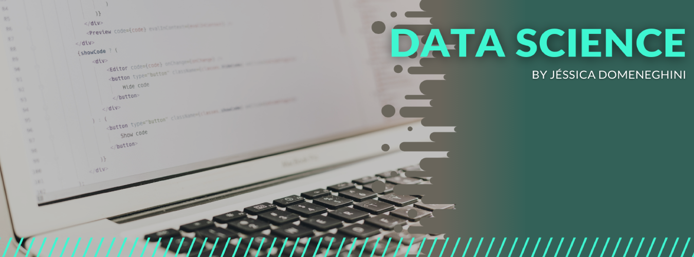

  

Aqui se encontram alguns projetos relacionados a Data Science.

**Background in:** Python, Machine Learning.

## Projetos:

* **Avaliação de Risco de Crédito:** https://bityli.com/QM3K1
* **Detecção de Fraude em Cartão de Crédito:** https://bit.ly/33pCFQ9
* **Prevendo Doenças Cardiovasculares:** https://bit.ly/33Czrcq
* **Classificando Vinhos:** https://bit.ly/2OSmEL8
* **Modelos Machine Learning - Examples:** https://bit.ly/3bzd1tN
* **Analisando Dados do Airbnb - Los Angeles:** https://bit.ly/3bCuQZM
* **Análise de Vendas de Videogame:** https://bit.ly/37oGaoI
* **Analisando Dados Olímpicos:**  https://bit.ly/2OONDXS

**Links:**
* [LinkedIn](https://www.linkedin.com/in/jdomeneghini)
* [Medium](https://www.medium.com/@jdomeneghini)

---
